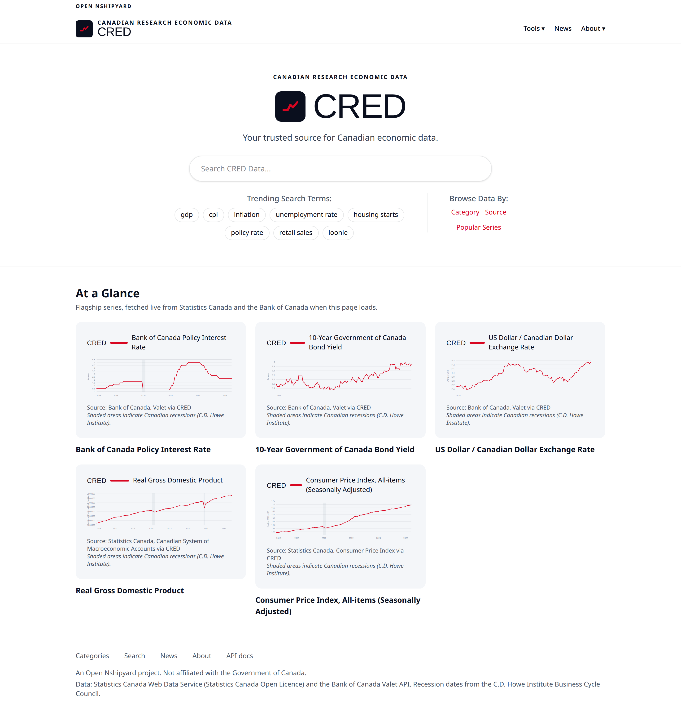
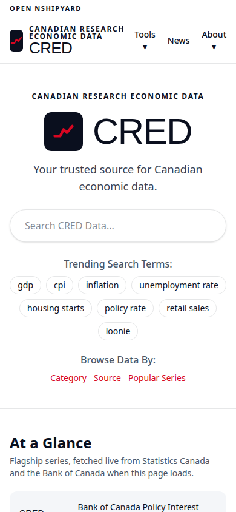
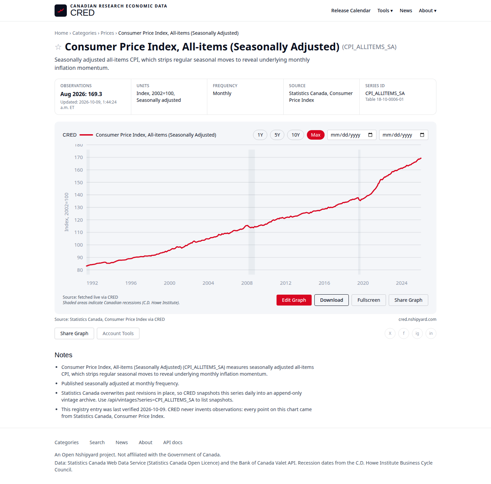
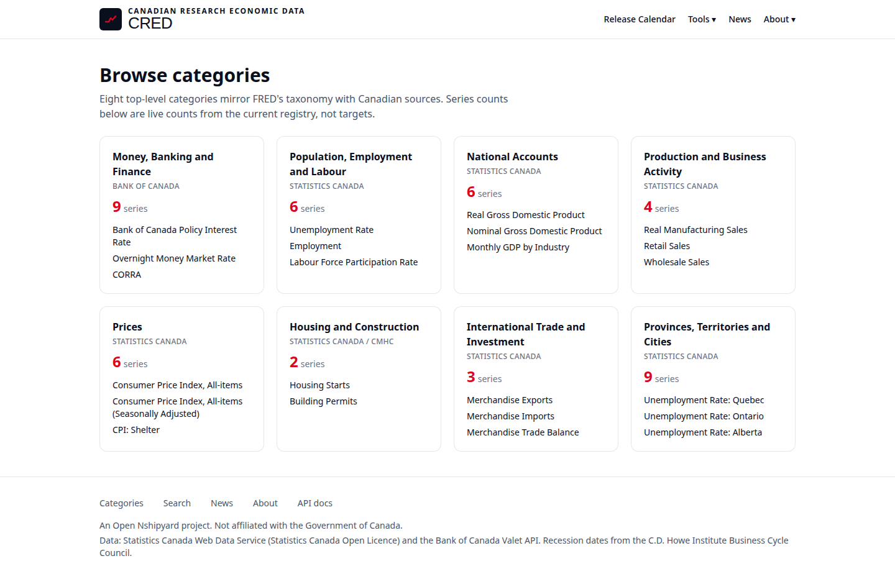

# CRED: Canadian Research Economic Data



CRED is a Canadian FRED: one search box across Statistics Canada and the Bank of Canada, FRED-style charts with Canadian recession shading, and a public read API. The v1 registry carries 45 verified series across 8 categories, from the BoC policy rate to CPI to provincial unemployment rates, and every observation shown anywhere in the app comes from Statistics Canada's Web Data Service or the Bank of Canada's Valet API. Nothing in CRED is copied from FRED, fabricated, or backfilled from a third party.

## Screenshots

All screenshots below show live data via StatCan/BoC, rendered by the app on 2026-10-09.


Home page: search, trending terms, and the At a Glance panel of six flagship series fetched live via StatCan/BoC.


Home page at 390px: the same live flagship panel stacks into a single column.


Series page for CPI_ALLITEMS_SA (Consumer Price Index, All-items, Seasonally Adjusted): 416 monthly observations, Jan 1992 through Aug 2026, with C.D. Howe recession shading, live data via StatCan/BoC.


Category browser: 8 categories mirroring FRED's taxonomy, with live series counts from the registry.

## Architecture: borrow, don't warehouse

CRED keeps no warehouse copy of upstream data. The design has three parts:

1. **The registry** (`src/lib/registry.ts`): 45 series mappings, each one binding a CRED series ID to the exact upstream location of its data (a StatCan table plus vector IDs, or a BoC Valet group plus series key). The registry is the only thing CRED owns about the data.
2. **A live proxy with a 24h cache** (`src/lib/data.ts`): pages and the `/api/observations` endpoint call the upstream endpoints directly at request time and cache each series in memory for 24 hours (stale-while-revalidate). StatCan and BoC stay the system of record; CRED never serves a stale copy it owns.
3. **Vintage snapshots** (`src/lib/vintages.ts`): StatCan overwrites past revisions in place, so revision history only exists from the day CRED starts collecting it. A daily cron snapshots each featured series into an append-only archive (Vercel Blob when `BLOB_READ_WRITE_TOKEN` is set, `./data/vintages/` in local dev). The archive starts empty on launch day.

There is no database in v1, by design.

## Data sources

| Source | What it supplies | Endpoint | Licence |
| --- | --- | --- | --- |
| Statistics Canada Web Data Service | LFS, CPI, GDP, trade, retail, housing, provincial labour (the majority of v1 series) | `https://www150.statcan.gc.ca/t1/wds/rest` | Statistics Canada Open Licence: reuse allowed with attribution |
| Bank of Canada Valet API | Policy rate, bond yields, T-bills, FX, monetary aggregates | `https://www.bankofcanada.ca/valet/observations/{key}/json` | Free reuse with attribution per BoC terms |
| C.D. Howe Institute Business Cycle Council | Canadian recession peak/trough dates used for chart shading | Published council chronology | Cited with attribution |

No observation in CRED was ever sourced from FRED. CRED borrows the chart layout and taxonomy from FRED; the data is Canadian, from Canadian sources.

## API

A FRED-style read API over Canadian economic data. No key required for reads. Responses are JSON. Observations come from the same 24h-cached live fetch as the charts, so each series is pulled from its source at most once per day. The full interactive reference is at `/api-docs` in the app.

```bash
# Search the registry by ID, title, or description (omit q to list all 45 series)
curl "https://cred.nshipyard.com/api/series?q=cpi"

# Full metadata for one series, including its StatCan table or Valet mapping
curl "https://cred.nshipyard.com/api/series/UNRATE_CA"

# Observations, ascending by date. from and to are optional ISO dates
curl "https://cred.nshipyard.com/api/observations?series=UNRATE_CA&from=2020-01-01&to=2020-04-01"

# The 8 top-level categories with live series counts from the registry
curl "https://cred.nshipyard.com/api/categories"

# Daily snapshot dates for a series from the vintage archive
curl "https://cred.nshipyard.com/api/vintages?series=UNRATE_CA"

# Daily vintage snapshot for every featured series (authorized only)
curl -H "Authorization: Bearer $CRON_SECRET" "https://cred.nshipyard.com/api/cron/snapshot"
```

The MCP connector (Phase 2) will map `search_series`, `get_observations`, and `get_release_calendar` onto these same endpoints, so agents can query Canadian macro data the way they query FRED today.

## The registry and the honesty rule

Every series mapping in `src/lib/registry.ts` was verified live on 2026-10-09 against Statistics Canada WDS or Bank of Canada Valet. When the WDS data endpoints returned HTTP 409 (table locked) for the Labour Force Survey table `14-10-0287-01` during the nightly refresh window, the LFS vectors were cross-checked against Statistics Canada's official full-table CSV for the 2026-09-04 release instead. Each registry entry carries a `lastVerified` date, and each series page prints the verification date in its notes.

The governing rule: an unverified mapping is dropped, not shipped. If a series cannot be confirmed against its upstream endpoint, it does not enter the registry.

## Run it

```bash
npm install
npm run dev      # development server
npm run build    # production build (must pass before any deploy)
npm run start    # serve the production build
```

The app fetches live data on first load. No API key is needed for StatCan WDS or the BoC Valet API.

### Environment variables

| Variable | Required | Purpose |
| --- | --- | --- |
| `CRON_SECRET` | For the cron route | Random string; `/api/cron/snapshot` accepts `Authorization: Bearer $CRON_SECRET` (or the `x-vercel-cron` header Vercel's own scheduler sends). Returns 401 without it. |
| `BLOB_READ_WRITE_TOKEN` | Optional | Connect a Vercel Blob store and the cron writes vintage snapshots to `vintages/<SERIES>/<yyyy-mm-dd>.ndjson` in Blob. Without it, snapshots go to `./data/vintages/`, which is gitignored and local-dev only. |

`vercel.json` declares the cron: `0 12 * * *` daily at `/api/cron/snapshot`. Set `CRON_SECRET` in the Vercel dashboard under Environment Variables before the first scheduled run.

## What's next

- **MCP server**: expose the registry to AI agents with `search_series`, `get_observations`, and `get_release_calendar` tools.
- **Provincial maps**: choropleths over the provincial series already in the registry.
- **Accounts and saved graphs**: let users save chart configurations and share them.
- **EN/FR**: a French interface for a Canadian public dataset is not optional, it is just scheduled after the data layer is solid.

## Attribution

Data: Statistics Canada Web Data Service (Statistics Canada Open Licence) and the Bank of Canada Valet API. Recession dates: C.D. Howe Institute Business Cycle Council. An Open Nshipyard project, not affiliated with the Government of Canada.

## Author

**Richardson Dackam**

- X: https://x.com/richardsondx
- GitHub: https://github.com/richardsondx
